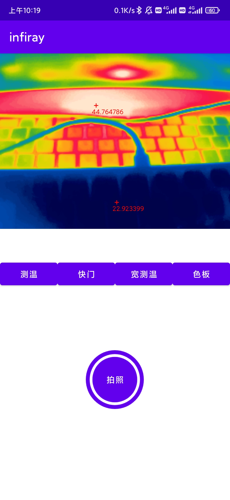

# infiray
InfiRay-Xtherm Demo 红外测温摄像头示例程序

## 声明

由于InfiRay官方提供的开发包和示例程序版本较低，不兼容最新的Android Studio，所以把代码移植到最新的开发环境中，并尽量改为Kotlin开发。

- 开发环境

  - Android Studio Dolphin | 2021.3.1 Patch 1

  - JDK 11
  - Android API 32 Platform
  - Gradle 7.4

- 本项目基于InfiRay官方提供开发包以及[UVCCamera](https://github.com/saki4510t/UVCCamera) 开发，仅供学习交流使用

## 开始使用

- 1、下载并安装infiray应用

- 2、给与infiray权限

读取手机存储、**相机**、录音、媒体音量控制权限建议都允许

- 3、打开应用，插入红外测温摄像头

提示是否允许访问摄像头，一定要点击 **确定**

- 4、这样就能看到预览画面

如图
 

点击色板，可以切换显示颜色，如图

- 5、拍照

点击中间拍照按钮，即可保存照片到相册内，图片名为 `infiray-时间戳.jpg`

保存路径为 `Pictures\infiray`

